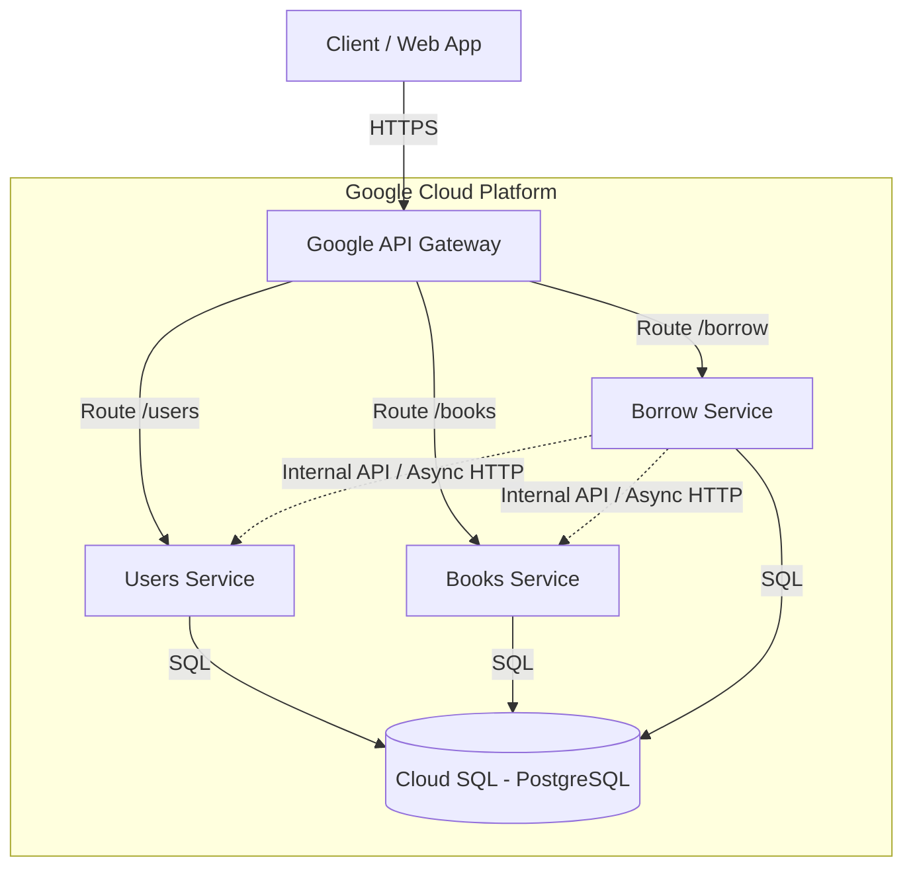

# Borrowed Book API

[](https://github.com/rfichi/borrowed_book_api/actions/workflows/ci-tests.yaml)
[](https://console.cloud.google.com/cloud-build)
[](https://fastapi.tiangolo.com)

A scalable, asynchronous microservices-based application for managing book borrowing, deployed on Google Cloud Platform.

## ☁️ Architecture

The system follows a microservices architecture pattern, utilizing Google Cloud Platform managed services for high availability and scalability.

> **Note**: The diagram below renders natively on GitHub. If you cannot see it, please view this file on the GitHub repository.



### Components
*   **API Gateway**: Central entry point handling routing, security, and rate limiting.
*   **Users Service**: Manages user identities and authentication (JWT).
*   **Books Service**: Manages the book catalog and inventory.
*   **Borrow Service**: Orchestrates the borrowing process, validating users and book availability via inter-service communication.
*   **Cloud SQL**: Shared PostgreSQL instance for data persistence.

## 🚀 Getting Started

### Prerequisites
*   **Docker** & **Docker Compose** installed.
*   **Python 3.10+** (for local script execution).
*   **PowerShell** (for Windows users).

### Local Development Environment

We have introduced a local environment that replicates the GCP architecture using Docker Compose and Nginx (mocking the API Gateway).

#### 1. Run the Local Environment
Use the provided PowerShell script to build and start the services. This script runs E2E tests to ensure everything is working.

```powershell
# Run E2E tests and tear down the environment afterwards
.\scripts\local-e2e.ps1 -build

# Run E2E tests and KEEP the environment running (useful for manual testing)
.\scripts\local-e2e.ps1 -build -alive
```

*   **-build**: Forces a rebuild of the Docker images.
*   **-alive**: Prevents `docker-compose down` from running after tests, leaving services up.

#### 2. Access Local Services
Once running (with `-alive`), you can access the services via the Nginx Gateway:

*   **Gateway**: `http://localhost:8080`
    *   Users: `http://localhost:8080/users/...`
    *   Books: `http://localhost:8080/books/...`
    *   Borrow: `http://localhost:8080/borrow/...`

## 💻 Development Workflow

### Branching Strategy
We follow a strict git workflow:
*   **Main Branch**: `main` (Production-ready code).
*   **Feature Branches**: `feature/name-of-feature` (Created from main).
*   **Branches Prefixes**: `feature/`, `fix/`, `hotfix/`, `chore/`, `refactor/`, `test/`.

### Commit Process
We use `pre-commit` hooks to ensure code quality and test coverage before every commit.

1.  **Install Hooks**:
    ```bash
    pip install pre-commit
    pre-commit install
    ```

2.  **Automatic Checks**:
    When you run `git commit`, the following checks run automatically:
    *   **Linting**: Flake8, Black, Isort.
    *   **Unit Tests**: Runs pytest on changed modules.
    *   **Coverage**: Enforces >90% code coverage on new changes (`diff-cover`).
    *   **Local E2E**: Runs the local E2E test suite (building images if needed).

    *If any check fails, the commit is blocked. Fix the issues and try again.*

### Testing
*   **Unit Tests**: Located in `tests/unit`. Run with `pytest`.
```bash
pytest tests/unit
```
*   **Integration Tests**: Located in `tests/integration`. Run with `pytest`.
```bash
pytest tests/integration
```
*   **E2E Tests**: Located in `tests/e2e`. These test the full flow against running containers.
```bash
pytest tests/e2e
```

## ⚙️ CI/CD Pipelines

### GitHub Actions (Continuous Integration)
Triggered on Pull Requests to `main`.
*   **Linting & Formatting**: Checks code style.
*   **Unit Testing**: Runs all unit tests with `pytest`.
*   **Coverage Report**: Fails if total coverage is below defined thresholds.

### Google Cloud Build (Continuous Deployment)
Triggered on Pushes to `main`.
*   **Build**: Builds Docker images for all services.
*   **Push**: Pushes images to Google Artifact Registry.
*   **Deploy**: Deploys new revisions to **Cloud Run**.
*   **Verify**: Runs post-deployment e2e tests.

## 🆕 Recent Updates (v0.5.8)

*   **Local E2E Environment**: Fully containerized local stack with Nginx acting as API Gateway.
*   **Async Refactoring**: All services (`users`, `books`, `borrow`) and their tests have been migrated to fully asynchronous execution using `asyncio`, `httpx`, and `asyncpg`.
*   **Enhanced Testing**: Added robust E2E testing scripts and `pre-commit` integration to prevent regressions.

## 📄 Documentation
*   [API Documentation (Swagger)](https://borrow-gateway-bwzk395v.uc.gateway.dev)
*   [Books Borrowing API Design](docs/books_borrowing_api_design.md)
*   [Deployment Guide](docs/deployment.md)
*   [E2E Testing Design](docs/e2e_testing_design.md)
*   [GCP FastAPI POC Plan](docs/gcp_fastapi_poc_plan.md)
*   [Next Steps POC](docs/next_steps_poc.md)
*   [Prompt GCP Migration](docs/prompt_gcp_migration.md)
*   [Previous README (V1)](docs/README_V1.md)
*   [Previous README (V2)](docs/README_V2.md)

## 📝 Changelog
See [CHANGELOG.md](CHANGELOG.md) for version history.

## 👥 Authors
*   **Rusel Fichi**
